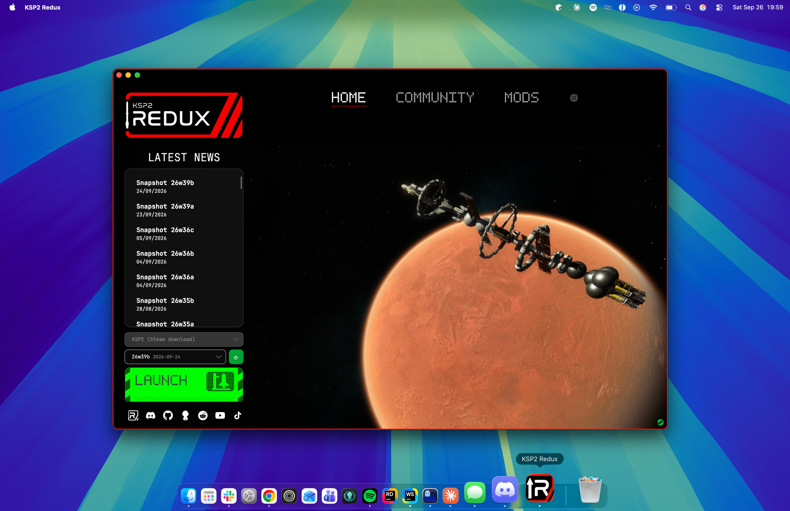
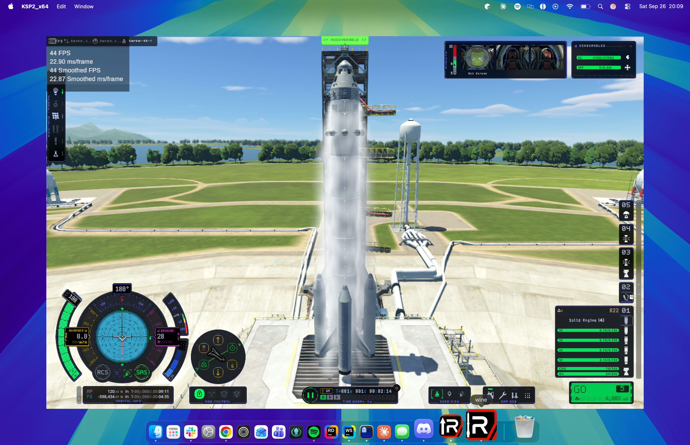
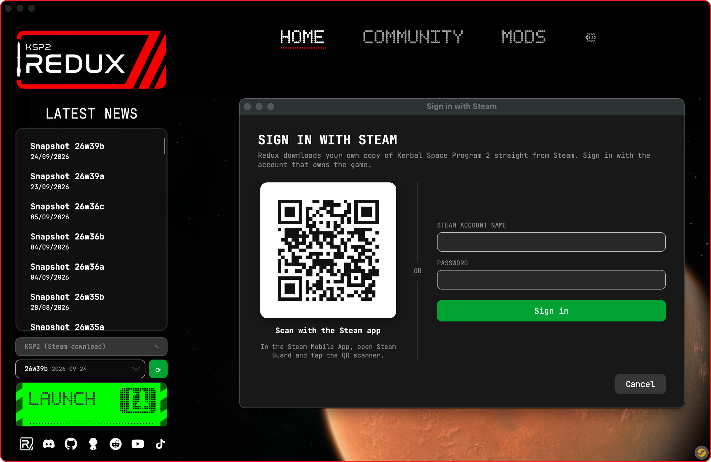
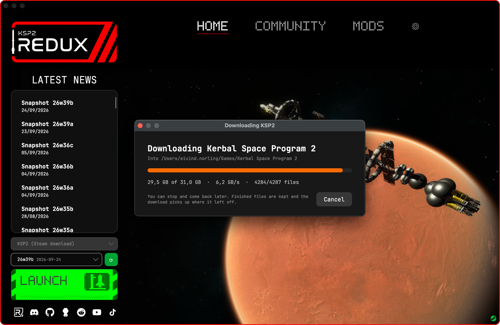
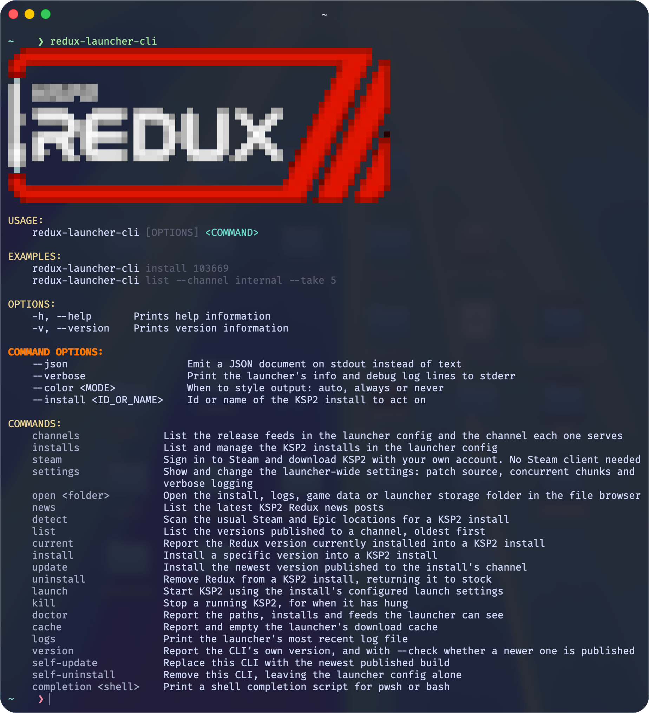
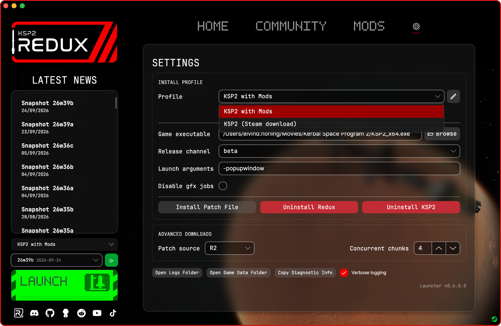
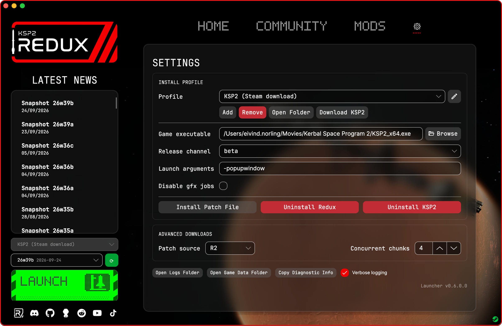

Hey! I'm Ewy from the Redux team. I mostly do the infrastructure and boring stuff: the launcher, the command line tool, the release pipeline and this website. None of the flashy stuff you see in the game is mine, that's all the other people on the team. But once in a while the boring stuff gets to have its moment, and this is it.

Launcher 0.6.0 is out and it's a big one. KSP2 runs on a Mac now, the launcher can sign in to Steam and download the game for you, and the CLI finally does everything the launcher does.

## KSP2 on a Mac

KSP2 never came out for the Mac. There's no macOS build of the game, and Steam won't even let you download it on one.

I've been working on this for quite a while, trying to make the whole setup as simple as possible so KSP2 with Redux just works on a Mac. The macOS launcher brings its own Wine runtime and runs the Windows version of the game, so there's no CrossOver or anything else to set up yourself.

The nerdy bit: Wine runs the Windows game, and DXMT translates its Direct3D 11 calls to Metal, which is what the GPU in your Mac actually speaks. The runtime is built from CodeWeavers' open source release of CrossOver 26.3 and bundled inside the app. If you already have CrossOver installed the launcher can use that too.

It's Apple Silicon only for now, and you need Rosetta 2 since the game and Wine are x86_64. If you don't have Rosetta the launcher tells you how to get it, instead of just falling over.

That's KSP2 Redux sitting on the launch pad in a window, on a Mac. The Dock calls it "wine", which is honestly fair. I've looked at this screen a lot by now and it still looks wrong to me, in a good way.

Once it's set up it's one click to play, same as on Windows and Linux. The first time has a few extra steps though:

1. Open the `.dmg` and drag KSP2 Redux into Applications
2. Approve the app the first time you open it. It isn't signed by Apple yet, so macOS will act like it's a virus. It's not, promise. The launcher shows you where to click (Privacy & Security, then Open Anyway)
3. Sign in to Steam
4. Download KSP2
5. Install Redux and hit Launch

## Signing in to Steam

This is the bit that makes the Mac version possible at all. Steam won't download KSP2 on a Mac, so the launcher just does it itself. It talks to Steam directly (using SteamKit2) and downloads the Windows version of the game from your own account. That works on Windows and Linux too, so if you'd rather not have the Steam client installed, you don't need it.

You can sign in with the QR code in the Steam Mobile App, or with your password and Steam Guard.

It can only download a copy you actually own, so sorry, no free KSP2 here. Downloads can be stopped and picked up again later, which is nice because the whole game is about 31 GB. There's also a small Steam icon in the bottom right corner that shows if you're connected, and clicking it lets you sign in, download or sign out.

Since you're handing the launcher your Steam login, a quick word on security. Your password is never saved, I don't want it. The only thing that's kept is the sign-in token, and that goes in Windows data protection on Windows, the keychain on macOS, and a file only your user can read on Linux. Signing out revokes it on Steam's side too, not just on your computer, and your Steam login name doesn't end up in the launcher log anymore.

## The CLI caught up

The command line tool, `redux-launcher-cli`, has kind of been the launcher's forgotten little sibling. This update finally gives it some attention. It has a macOS build now, and it launches and stops the game through the same Wine runtime and prefix as the launcher, so your saves are shared between the two.

New stuff:

- `steam login`, `logout`, `status` and `download`, and the QR code gets drawn right in your terminal
- `installs show`, `set` and `delete` for the install settings, like the game path, launch arguments, gfx jobs and launch via Steam
- `settings` for the launcher-wide stuff, like the patch source and concurrent chunks
- `open` for the install, logs, game data and storage folders
- `news` for the latest posts from this blog (hi)

`doctor` got a glow up as well. It lines up its values now and tells you about the Wine runtime, Rosetta and whether you're signed in to Steam. Which means that when you come to us with a problem, the first thing we'll ask for is the output of `doctor`. You've been warned.

Run it without any arguments and you get this. Yes, it has a pixel art logo. No, I will not be taking questions.

So you can now go from nothing to playing KSP2 Redux without opening a single window. Great for the terminal people. I'm terminal people.

## Everything else

The Settings tab got reworked around install profiles, so you can keep a few KSP2 installs side by side, like a clean one and one full of mods, and switch between them. The pencil next to the dropdown renames them.

There's also a Browse button for the game executable, a Download KSP2 button right in the profile, and an Uninstall KSP2 button that deletes the game but keeps your saves. If it's a copy Steam manages, it hands it back to Steam instead. And the spacing is finally even, which bugged me way more than it should have.

Plus a bunch of fixes. The launcher could get stuck on startup because a prompt opened behind the main window, where nobody could see it. It could also just quietly close if it crashed while starting, which is the worst kind of bug to get a report about. Now it shows the error and writes it to `bootstrap.log` in the logs folder. If the launcher crashes or doesn't show up at all (mostly on Windows 10), try adding `--software-rendering` or `--no-composition` to the end of the shortcut's Target.

The full changelog is on [GitHub](https://github.com/KSP2Redux/Updater/releases/tag/updater-v0.6.0.0).

## Download

Grab it from the [download page](/download/). On a Mac that's `KSP2-Redux-macOS-arm64.dmg`. If you already have the launcher it should offer to update itself.

This is the first version of the Mac launcher, so things will break. When they do, run `redux-launcher-cli doctor` (told you) and send the output along with your report on the [Discord](https://discord.gg/ksp2redux) or on [GitHub](https://github.com/KSP2Redux/Updater/issues).

Have fun, and see you in orbit!
