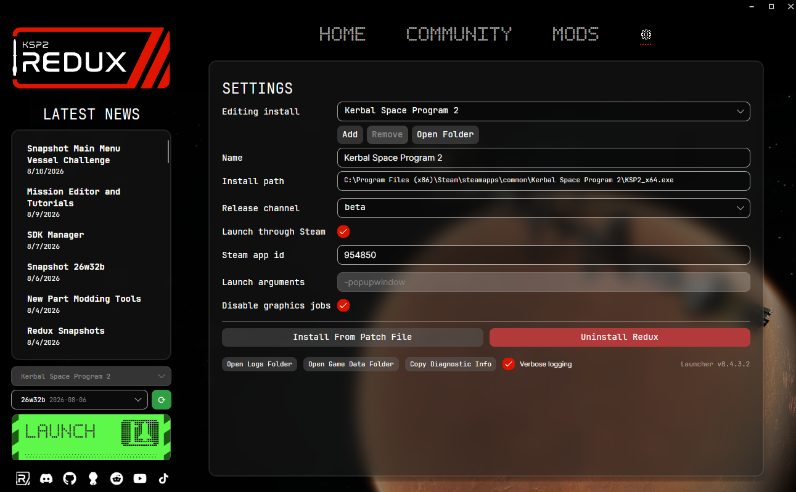

import { Aside } from '@astrojs/starlight/components';

This guide will walk you through installing KSP2 Redux on your system. If you just need the files, head to the [download page](/download/).

<Aside type="caution" title="Beta Software">
We are currently in the beta testing phase. Please keep in mind that some things may be broken.
</Aside>

## Requirements

- **KSP2 Version:** You must have stock KSP2 v0.2.2.0 installed (the latest official version)
- **Disk Space:** At least 4 GB of free space for new assets
- **Operating System:** Windows or Linux (x64), or macOS on an Apple Silicon Mac with Rosetta 2

## Installation Steps

### 1. Download the Updater

Get the Redux Updater for your system from the [download page](/download/): `Ksp2Redux-win-x64.exe` on Windows, `KSP2-Redux-macOS-arm64.dmg` on macOS or `Ksp2Redux-linux-x64` on Linux. It always has the newest version.

On Linux, mark it executable before running it:

```sh
chmod +x Ksp2Redux-linux-x64
./Ksp2Redux-linux-x64
```

<Aside type="note" title="On macOS">
Open the `.dmg` and drag **KSP2 Redux** into **Applications**. The Updater isn't signed by Apple yet, so the
first time you open it macOS says it could not verify the app. Click **Done**, then go to **System Settings**,
**Privacy & Security**, click **Open Anyway** next to the message about KSP2 Redux and confirm with your password
or Touch ID.

KSP2 never shipped for the Mac and Steam won't download it there, so sign in to Steam in the Updater and use
**Download KSP2** in the settings tab to get your copy. The Updater runs the game through its own bundled Wine
runtime, no CrossOver needed.
</Aside>

### 2. Run the Updater

1. Run the downloaded updater
2. Setup your KSP2 Installation in the settings tab (if not auto-detected)
3. Make sure the release channel in the settings tab is the one you want (it should be setup by default)
4. Go back to the home tab



### 3. Select Version To Install

In the dropdown on the Home tab, select the version you want to install

### 4. Install

1. Click **Install**
2. Wait for the progress bar to disappear

### 5. Launch the Game

Press Launch

You can also launch the game through Steam/Epic, or by running `KSP2_x64.exe` in the game folder as normal.

<Aside type="tip" title="On Linux">
The game itself runs through Proton. If you are on Linux, read [Linux Support](/guides/linux-support/)
for Proton versions, launch options and known working setups. You will also want to enable
**Launch through Steam** in the Updater's settings.
</Aside>

## Installing From The Command Line

There is also a CLI, `redux-launcher-cli`, that does the same install as the Updater window from a
terminal. It reads and writes the same config, so you can move between the two freely. It works on
Windows, macOS and Linux and does not need administrator rights.

Install it with one line, or download `redux-cli-x64.exe` (Windows), `redux-cli-macos-arm64` (macOS) or `redux-cli-x64` (Linux) manually from the [download page](/download/#command-line). On a Mac, use the same `curl` line as on Linux:

```powershell
irm https://raw.githubusercontent.com/KSP2Redux/Updater/main/scripts/install-cli.ps1 | iex
```

```sh
curl -fsSL https://raw.githubusercontent.com/KSP2Redux/Updater/main/scripts/install-cli.sh | bash
```

That puts the binary in `%LOCALAPPDATA%\Programs\redux-launcher-cli` on Windows or `~/.local/bin` on
Linux and adds it to your PATH. Running the installer again upgrades it in place.

Then the usual flow is:

```sh
redux-launcher-cli --help         # every command, with examples
redux-launcher-cli detect         # find KSP2 the way the Updater does
redux-launcher-cli installs add   # add the install it found to the config
redux-launcher-cli update         # install the newest build in its channel
redux-launcher-cli launch         # start the game
```

It keeps itself current with `redux-launcher-cli self-update`, and `version --check` reports whether
a newer build is published. It also mentions new releases once a day while you are using it, which
`--no-update-check` turns off. `self-uninstall` removes the binary and leaves your config alone.

For scripting, `--json` writes a document to stdout and everything else to stderr, exit codes are
stable, and `completion pwsh|bash` prints a shell completion script.

## Verifying Installation

Once the game launches, you should see Redux-specific features and UI elements. Check the main menu for Redux version information.

## Troubleshooting

### Installation Takes Too Long
- Check that your antivirus isn't scanning files during installation
- Make sure you have sufficient disk space

### Game Won't Launch
- Ensure your original KSP2 installation is v0.2.2.0
- On Windows, make sure the path to your KSP2 installation is not too long (ideally under 200 characters, Windows can struggle with very long nested paths)

### Missing Files Error
- Verify the integrity of your stock KSP2 installation through Steam/Epic

## Uninstalling

To uninstall KSP2 Redux, go to settings in the Updater and press uninstall

## Reporting Issues

If you encounter bugs, please use the in-game bug report feature:
- Press **Ctrl+B**, or
- Press **Escape** → **Report Redux Bug**

This automatically attaches useful information like screenshots, logs, and save files to help us reproduce the issue.

Alternatively, report issues in the **#🟡redux-bugs** channel on the [KSP2 Redux Discord server](https://discord.gg/ksp2redux).

## Next Steps

- Learn about [mod compatibility](/guides/mod-compatibility/)
- Check out the [changelog](https://github.com/KSP2Redux/Redux/releases)
